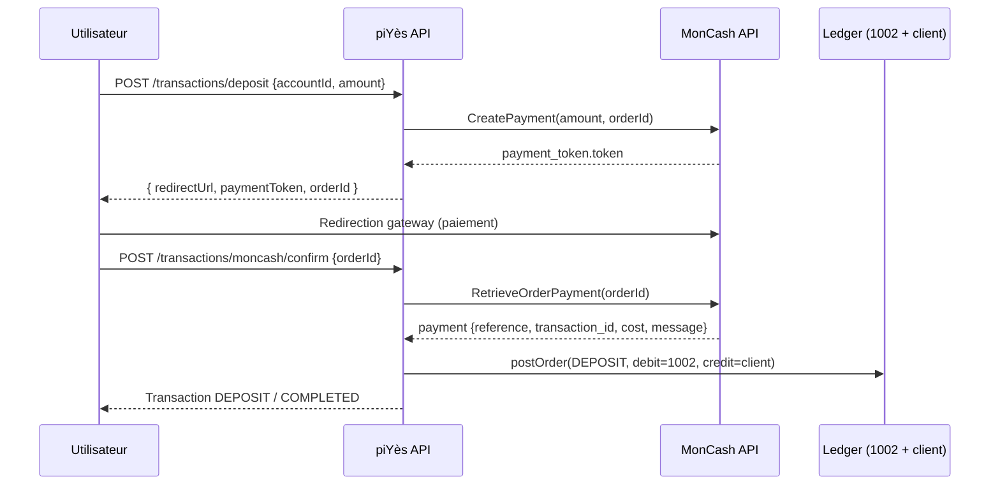
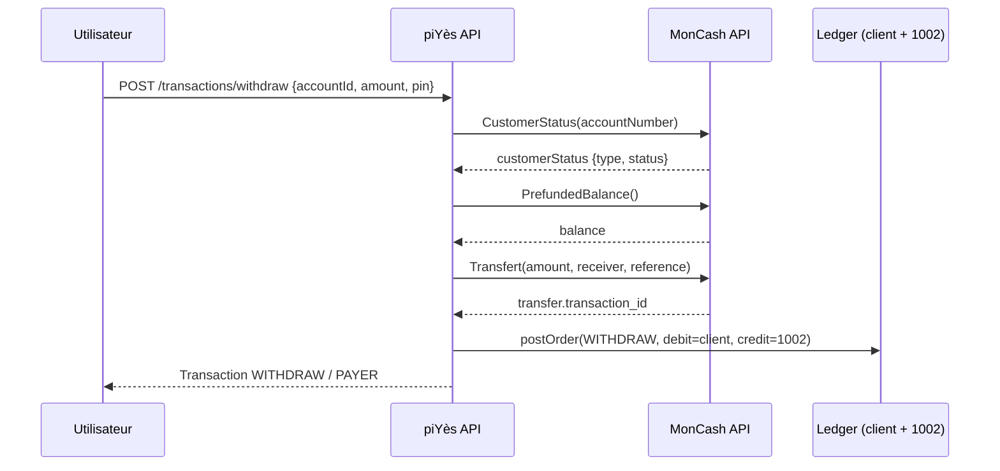

# Intégration MonCash

Documentation de l'intégration MonCash (sandbox Digicel) dans l'API piYès.
Conforme à `api/RestAPI_MonCash.md`.

## Table des matières

- [Configuration](#configuration)
- [Architecture](#architecture)
- [Comptes ledger](#comptes-ledger)
- [Endpoints](#endpoints)
- [Flux détaillés](#flux-détaillés)
- [Base de données](#base-de-données)
- [Tests](#tests)
- [Dépannage](#dépannage)

## Configuration

Copier `.env.example` vers `.env` et renseigner :

| Variable | Description |
| --- | --- |
| `MONCASH_CLIENT_ID` | Client ID fourni par Digicel (sandbox) |
| `MONCASH_CLIENT_SECRET` | Client secret fourni par Digicel (sandbox) |
| `MONCASH_API_HOST` | Base API. Par défaut `https://sandbox.moncashbutton.digicelgroup.com/Api` |
| `MONCASH_GATEWAY_URL` | URL de redirection. Par défaut `https://sandbox.moncashbutton.digicelgroup.com/Moncash-middleware` |
| `MONCASH_ADMIN_SECRET` | Secret admin pour `GET /moncash/prefunded-balance` |

> En test, `MONCASH_API_HOST` peut pointer vers un serveur local
> (`http://127.0.0.1:PORT/Api`) pour simuler l'API sans réseau.

Si `MONCASH_CLIENT_ID` / `MONCASH_CLIENT_SECRET` sont absents, le service
lève une `MonCashError` (code `MONCASH_CONFIG`) dès la première requête —
fail fast, aucun cache de token ne tente de se créer.

## Architecture

```
piyes-api
  └── server/src/services/moncashService.ts   (client REST MonCash)
  └── server/src/services/ledgerService.ts     (ledger + getMonCashPrefundedAccountId)
  └── server/src/routes/transactions.ts        (deposit / withdraw / confirm + endpoints annexes)
```

`moncashService.ts` :
- `envConfig()` relit les variables d'environnement à chaque appel (testable).
- `request()` centralise les appels HTTP (timeout 15 s, `AbortController`).
- `getAccessToken()` met en cache le token OAuth ~50 s (TTL MonCash 59 s).
- Erreurs normalisées : `MonCashError` avec `status` + `moncashMessage`.

Fonctions exposées :
| Fonction | Endpoint MonCash |
| --- | --- |
| `createPayment(amount, orderId)` | `POST /v1/CreatePayment` |
| `getCustomerStatus(accountNumber)` | `GET /v1/CustomerStatus` |
| `transfer(amount, receiver, reference, desc?)` | `POST /v1/Transfert` |
| `retrieveTransactionPayment(transactionId)` | `POST /v1/RetrieveTransactionPayment` |
| `retrieveOrderPayment(orderId)` | `POST /v1/RetrieveOrderPayment` |
| `getPrefundedBalance()` | `GET /v1/PrefundedBalance` |
| `prefundedTransactionStatus(reference)` | `POST /v1/PrefundedTransactionStatus` |

## Comptes ledger

| Code | Nom | Type | Usage |
| --- | --- | --- | --- |
| `1001` | Caisse piYès HTG | ASSET | Dépôts/retraits internes |
| `1002` | Compte préfondé MonCash HTG | ASSET | Dépôts MonCash (crédit) et retraits MonCash (débit) |

Le compte préfondé `1002` est créé automatiquement par
`getMonCashPrefundedAccountId()` (pattern identique à la caisse `1001`).

## Endpoints

Tous les endpoints sont sous `/api/v1` et protégés par `authMiddleware`
(JWT bearer) sauf mention contraire.

### `POST /transactions/deposit`

Dépôt depuis un compte lié.

- Compte `moncash` : crée une transaction `PENDING`, appelle `CreatePayment`,
  retourne `{ redirectUrl, paymentToken, mode, orderId }`.
  Le client redirige l'utilisateur vers `redirectUrl` (gateway MonCash),
  puis appelle `/transactions/moncash/confirm`.
- Compte interne `piyes` : dépôt classique via ledger (inchangé).

### `POST /transactions/moncash/confirm`

Confirme un dépôt MonCash. Anti-rejeu.

Body :
```json
{ "transactionId": "12874820" }
```
ou
```json
{ "orderId": "uuid-du-deposit" }
```

Déroulé :
1. `RetrieveTransactionPayment(transactionId)` ou `RetrieveOrderPayment(orderId)`.
2. Si `payment.message === "successful"` :
   - Anti-rejeu : si une Transaction existe déjà avec ce `moncashTransactionId`
     ou cet `external_id` (`reference` MonCash), elle est renvoyée telle quelle.
   - Ledger : débit du compte préfondé `1002` → crédit du compte ledger client
     (`postOrder` type `DEPOSIT`).
   - Insert/upsert d'une Transaction `DEPOSIT`/`COMPLETED` avec
     `moncashTransactionId`, `moncashReference`, `payment_order_id`.
3. Réponse : la Transaction.

### `POST /transactions/withdraw`

Retrait. Cible MonCash → payout réel :

1. PIN requis (400 si absent, `verifyPin` sinon).
2. `getCustomerStatus` : éligible si `type === "fullkyc"` et
   `status` contient `"active"`, sinon 400 `MONCASH_CUSTOMER_INELIGIBLE`.
3. `getPrefundedBalance` : solde préfondé ≥ montant, sinon 400
   `MONCASH_PREFUNDED_INSUFFICIENT`.
4. `transfer(amount, accountNumber, reference)` (idempotence via
   `Idempotency-Key` ou UUID).
5. Ledger : débit compte client → crédit préfondé `1002`
   (`postOrder` type `WITHDRAW`).
6. Insert Transaction `WITHDRAW`/`PAYER` avec `moncashTransactionId`,
   `moncashReference`, `payment_order_id` + Notification.

Cible interne `piyes` : retrait classique via la caisse `1001` (inchangé).

### `POST /transactions/moncash/order-payment`

```json
{ "orderId": "..." }
```
Retourne `retrieveOrderPayment(orderId)`.

### `POST /transactions/moncash/transfer-status`

```json
{ "reference": "ref-payout" }
```
Retourne `prefundedTransactionStatus(reference)` (statut d'un payout).

### `GET /transactions/moncash/prefunded-balance`

Solde du compte préfondé MonCash. Requiert l'en-tête :

```
x-admin-secret: <MONCASH_ADMIN_SECRET>
```

403 si le secret est absent, non configuré ou invalide.

## Flux détaillés

### Dépôt MonCash



### Retrait MonCash (payout)



## Base de données

### Colonnes `Transaction` (ajouts MonCash)

| Colonne | Type | Description |
| --- | --- | --- |
| `moncashTransactionId` | text | `transaction_id` MonCash (payout ou payment) |
| `moncashReference` | text | `reference` MonCash (idempotence payout / payment) |
| `payment_order_id` | text | id de l'ordre ledger (`postOrder`) |
| `status` | text | `PENDING` (dépôt en attente) / `COMPLETED` |

> `status` : si la colonne n'existe pas en base, la créer via :
> ```sql
> ALTER TABLE "Transaction" ADD COLUMN IF NOT EXISTS status text DEFAULT NULL;
> NOTIFY pgrst, 'reload schema';
> ```

### RPC ledger utilisées

- `piyes_ledger_get_or_create_customer_account(p_customer_user_id, p_name,
  p_piyes_account_id, p_piyes_user_id, p_initial_balance_cents)`
- `piyes_ledger_post(p_idempotency_key, p_type, p_customer_user_id,
  p_amount_cents, p_debit_account_id, p_credit_account_id, p_description,
  p_external_ref)`

> Attention : `p_customer_user_id` doit toujours être renseigné (non `undefined`),
> sinon PostgREST lève `PGRST202` (fonction introuvable dans le schema cache).

## Tests

Suite dédiée : `server/test/moncash.test.ts` (15 tests).

- Mock HTTP local reproduisant les réponses exactes de la doc :
  OAuth token (`expires_in: 59`), `payment_token`, wrapper `customerStatus`,
  objet `balance`, `transfer`, `403 Maximum Account Balance`,
  `RetrieveOrderPayment`/`RetrieveTransactionPayment`,
  `PrefundedTransactionStatus`.
- Tests service : parsing conforme à la doc, cache token (1 seul `/oauth/token`),
  erreurs (403, config manquante).
- Tests E2E : `/withdraw` payout réel, erreurs KYC/PIN/solde préfondé,
  `/moncash/order-payment`, `/moncash/transfer-status`,
  `/moncash/prefunded-balance` (403 sans secret), et le flux complet
  deposit → confirm → ledger crédité.

Lancer la suite complète :

```bash
npm test
```

## Tests PowerShell (scripts)

Des scripts PowerShell testent le flux MonCash et les endpoints annexes sans
dépendre de la suite TS. Ils s'appuient sur les mêmes endpoints publics que
l'app mobile.

Prérequis :
1. Serveur démarré : `npm run dev` (ou `npx tsx server.ts`).
2. `.env` renseigné avec `MONCASH_CLIENT_ID` / `MONCASH_CLIENT_SECRET`
   (sandbox réelle, ou mock local pointé par `MONCASH_API_HOST`).
3. `SUPABASE_URL` + `SUPABASE_SERVICE_ROLE_KEY` (seed du solde ledger dans
   `Set-UserBalance`).
4. `MONCASH_ADMIN_SECRET` pour tester le `200` de `/prefunded-balance`.

### Flow complet (`test-flow.ps1`)

Signup → PIN → lien compte MonCash → deposit → confirm (ledger crédité) →
anti-rejeu → withdraw payout → erreur sans PIN.

```powershell
powershell -File scripts/moncash/test-flow.ps1 -BaseUrl http://127.0.0.1:3000
```

Variable optionnelle : `TEST_MONCASH_PHONE` pour choisir le numéro MonCash
lié (défaut : `50937007294`).

### Endpoints annexes (`test-endpoints.ps1`)

`order-payment`, `transfer-status`, `prefunded-balance` (403 sans/mauvais
secret, 200 avec le bon secret si `MONCASH_ADMIN_SECRET` est défini).

```powershell
powershell -File scripts/moncash/test-endpoints.ps1 -BaseUrl http://127.0.0.1:3000
```

### Fonctions réutilisables (`helpers.ps1`)

Module importé par les deux scripts : `Invoke-Api`, `Invoke-ApiStatus`,
assertions (`Assert-Equal`, `Assert-True`, `Assert-NotNull`), `New-TestUser`,
`Set-TestPin`, `Add-MonCashAccount`, `Set-UserBalance`,
`Get-MonCashPrefundedBalance`.

### Sortie

```
  [PASS] confirm.status == COMPLETED
  [FAIL] ... (attendu: X, obtenu: Y)

===== Résumé =====
  Pass: 22  Fail: 0
```

Un échec (`Fail > 0`) fait sortir le script avec le code `1`.

## Dépannage

| Symptôme | Cause | Correctif |
| --- | --- | --- |
| `MONCASH_CONFIG` | `MONCASH_CLIENT_ID`/`MONCASH_CLIENT_SECRET` manquants | Renseigner le `.env` |
| `LEDGER_NOT_INITIALIZED` | Fonction RPC ledger introuvable (PGRST202) | Vérifier `ledger.sql` + `p_customer_user_id` renseigné |
| `Could not find the 'status' column` | Colonne `status` absente de `Transaction` | `ALTER TABLE` (voir section base de données) |
| `MONCASH_CUSTOMER_INELIGIBLE` | Compte non fullkyc / inactif | Vérifier le numéro MonCash |
| `MONCASH_PREFUNDED_INSUFFICIENT` | Solde préfondé < montant | Approvisionner le compte préfondé |
| `FORBIDDEN` (prefunded-balance) | `x-admin-secret` manquant/incorrect | Vérifier `MONCASH_ADMIN_SECRET` |
